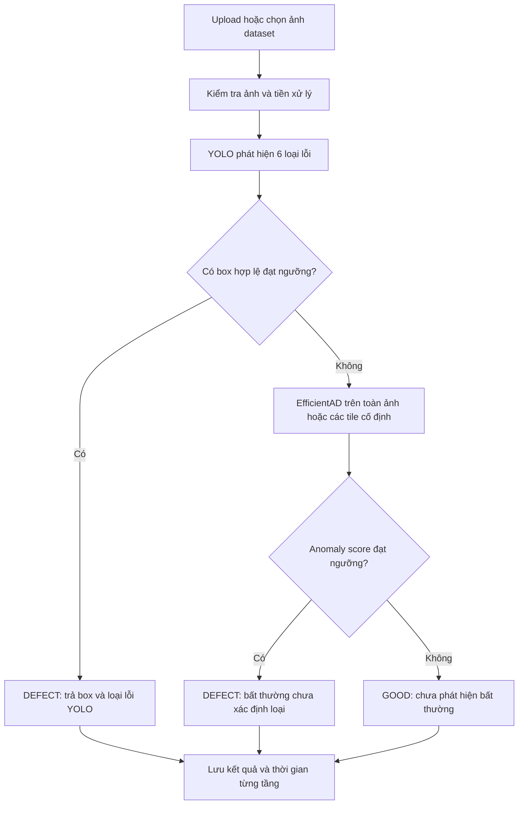

# Kế hoạch phát triển và kiểm thử PCB Hybrid YOLO + EfficientAD

Ngày lập: **24/09/2026**. Trạng thái: **kế hoạch triển khai, chưa huấn luyện hay công bố kết quả mới**.

Thư mục làm việc riêng: `D:\FPTU\KLTN\PCB_YOLO_EfficientAD_Lab`.

Mục tiêu là xây dựng hệ thống kiểm thử core AI cho ảnh PCB trần: phát hiện sáu loại lỗi bằng YOLO, chuyển ảnh không được YOLO phát hiện sang EfficientAD, cung cấp giao diện kiểm thử và benchmark chung để chọn cấu hình cân bằng giữa bỏ sót, báo nhầm và tài nguyên. Sản phẩm của giai đoạn này chạy bằng ảnh có sẵn, chưa cần PCB vật lý, camera hay robot.

**Đề xuất bắt đầu:** YOLO11n + EfficientAD-S theo cascade hai tầng; Streamlit cho giao diện nội bộ; một core inference và một evaluator dùng chung cho CLI, giao diện và benchmark. Đây là cấu hình xuất phát để kiểm chứng, chưa phải mô hình được xác nhận tốt nhất.

## 1. Dữ liệu và trạng thái đã xác minh

### 1.1. Đường dẫn và căn cứ

Đường dẫn được cung cấp `D:\FPTU\KLT\Datasetver4_Public` không tồn tại trong môi trường hiện tại. Dataset tìm thấy và được dùng làm cơ sở cho kế hoạch là:

```text
D:\FPTU\KLTN\DatasetVer4_Public
```

Các tài liệu đã đối chiếu trực tiếp:

- [README dataset](../DatasetVer4_Public/README.md), [dataset card](../DatasetVer4_Public/DATASET_CARD.md), [trạng thái thực thi](../DatasetVer4_Public/status.json).
- [Manifest canonical](../DatasetVer4_Public/benchmarks/deeppcb/manifests/samples.jsonl), [schema lớp](../DatasetVer4_Public/benchmarks/deeppcb/configs/classes.json), [split](../DatasetVer4_Public/benchmarks/deeppcb/splits/holdout.json).
- [Thống kê build](../DatasetVer4_Public/benchmarks/deeppcb/audit/build_summary.json), [kiểm tra dataset trước đó](../DatasetVer4_Public/benchmarks/deeppcb/audit/verification.json), [release đã khóa](../DatasetVer4_Public/benchmarks/deeppcb/release.json).

Trong phiên lập kế hoạch đã đọc lại toàn bộ manifest, đối chiếu số lượng, kiểm tra sự tồn tại của ảnh/nhãn và xác minh SHA-256 của **18/18 tệp được khóa trong release**. Manifest có **2.998 ảnh 640×640**, không thiếu đường dẫn ảnh/nhãn; không có giao `source_group`, hash ảnh hoặc hash pixel giữa train và test theo metadata. Đây không phải lần chạy lại toàn bộ kiểm tra decode/hash của 2.998 ảnh; bước kiểm toán triển khai bên dưới vẫn phải thực hiện.

### 1.2. Phân chia hiện có

| Partition | Good | Defect | Tổng ảnh | Nhóm nguồn | Vai trò trong dự án mới |
|---|---:|---:|---:|---:|---|
| `train` | 895 | 897 | 1.792 | 5 | YOLO học cả hai; EfficientAD chỉ học 895 good |
| `calibration` | 230 | 230 | 460 | 2 | Validation, chọn checkpoint, chuẩn hóa AD và hiệu chỉnh ngưỡng |
| `fusion` | 153 | 153 | 306 | 2 | Tập phát triển để so sánh/chọn cấu hình sau calibration |
| `test` | 220 | 220 | 440 | 2 | Đánh giá cuối cùng sau khi khóa cấu hình |
| **Tổng** | **1.498** | **1.500** | **2.998** | **11** | Không chia ngẫu nhiên lại theo ảnh |

Tên partition `fusion` được giữ nguyên trong manifest nguồn. Dự án mới dùng alias **`development_selection`** cho vai trò của tập này; cascade cơ bản không cần huấn luyện fusion head. Phải ghi thay đổi vai trò vào protocol mới, vì protocol nguồn đang mô tả tập này dành cho fit fusion. Không sửa protocol/release nguồn và không gọi kết quả mới là tái lập nguyên trạng protocol cũ.

### 1.3. Sáu loại lỗi

| ID YOLO | Nhãn chuẩn | Diễn giải tiếng Việt | Bbox train | Bbox test |
|---|---|---|---:|---:|
| 0 | `open_circuit` | Đứt đường mạch | 1.216 | 298 |
| 1 | `short` | Chập/nối tắt đường mạch | 973 | 215 |
| 2 | `mouse_bite` | Khuyết mép đường đồng | 1.228 | 250 |
| 3 | `spur` | Gai/thừa đồng nhô ra | 981 | 228 |
| 4 | `spurious_copper` | Đồng thừa rời rạc | 884 | 194 |
| 5 | `pin_hole` | Lỗ nhỏ trong vùng đồng | 865 | 222 |

Một ảnh có thể chứa nhiều box và nhiều loại lỗi. Không biến bài toán thành phân loại một nhãn duy nhất cho mỗi ảnh. `pin_hole` không tương đương `missing_hole` của dataset PKU trước đây.

### 1.4. Giới hạn phải phản ánh trong kết luận

- Benchmark hiện tại dựa trên DeepPCB, có bbox nhưng **không có mask phân đoạn chuẩn**. Không báo pixel AUROC, Dice, IoU segmentation hoặc AUPRO như kết quả có ground truth.
- Ảnh good là template đã được tác giả làm sạch; chưa đại diện đầy đủ ảnh tốt tự nhiên từ camera. Ảnh lỗi của nguồn có phần bổ sung thủ công. Cần kiểm tra mô hình có học dấu vết xử lý thay vì bản chất lỗi hay không.
- `source_group` chỉ là nhóm nguồn; chưa xác minh được thiết kế hay bo vật lý. Đơn vị kết quả chính là **ảnh/crop PCB**, chưa phải một bo nguyên vẹn.
- Calibration và test mỗi tập chỉ có hai nhóm nguồn. Số lượng ảnh không đồng nghĩa số quan sát vật lý độc lập; kết luận về tổng quát hóa và các tỷ lệ rất thấp phải thận trọng.
- Trạng thái nguồn ngày 23/09/2026 ghi chưa train baseline GPU đầy đủ; máy khi đó dùng Intel Arc và PyTorch CPU. Bước thiết lập phải kiểm tra lại phần cứng hiện tại, không mặc định có CUDA hoặc RTX 3070.
- Số ảnh good nhiều hơn bộ trước tạo điều kiện thử EfficientAD, nhưng chưa chứng minh hybrid tốt hơn. Benchmark phải cho phép kết luận YOLO đơn phù hợp hơn nếu dữ liệu thực nghiệm cho thấy vậy.

## 2. Phạm vi và câu hỏi cần trả lời

### 2.1. Sản phẩm cần bàn giao

1. Dataset adapter và báo cáo kiểm toán có thể tái chạy.
2. Các baseline được train/fit theo cùng quy tắc, có checkpoint và cấu hình đầy đủ.
3. Pipeline hai tầng YOLO → EfficientAD cùng bộ ngưỡng đã khóa.
4. Benchmark thống nhất, có bảng tổng hợp và dự đoán từng ảnh để đối chiếu.
5. Giao diện tải ảnh, xem box/heatmap, giải thích tuyến xử lý, kiểm thử batch và so sánh mô hình.
6. Gói chạy lại, hướng dẫn sử dụng và báo cáo lựa chọn mô hình cho đồ án.

Không phát triển lại kiến trúc ba nhánh trong lộ trình này. Không đưa camera, điều khiển robot hoặc phân loại vật lý vào tiêu chí nghiệm thu core AI.

### 2.2. Giả thuyết thực nghiệm

- H1: EfficientAD phát hiện thêm được một phần ảnh lỗi mà YOLO không có box vượt ngưỡng.
- H2: Mức tăng phát hiện lỗi đủ lớn so với số ảnh tốt bị báo nhầm thêm và chi phí chạy tầng hai.
- H3: Độ phân giải/tiling ảnh hưởng đáng kể tới lỗi nhỏ; cần đo thay vì chỉ dựa vào mặc định thư viện.
- H4: Mô hình được chọn giữ được cân bằng trên nhóm nguồn chưa thấy và qua nhiều seed.

Thí nghiệm sáu lớp đã biết không tự chứng minh khả năng phát hiện mọi loại lỗi mới. Muốn khẳng định khả năng phát hiện loại lỗi chưa thấy cần protocol riêng ở mục 9.

## 3. Thiết kế cascade hai tầng

### 3.1. Luồng xử lý chính



Quy tắc baseline, với defect là lớp dương:

```text
detections = YOLO(image, preprocessing_version, inference_parameters)
accepted_boxes = các box thuộc schema hợp lệ và confidence >= tau_yolo

if accepted_boxes không rỗng:
    final_status = DEFECT
    decision_source = YOLO
    efficientad_executed = false
else:
    anomaly_score, anomaly_map = EfficientAD(image)
    final_status = DEFECT nếu anomaly_score >= tau_ad, ngược lại GOOD
    decision_source = EFFICIENTAD
    efficientad_executed = true
```

`tau_yolo`, `tau_ad`, quy tắc lấy image score, preprocessing và hậu xử lý đều phải được lưu cùng artifact. Chọn toán tử `>=` cho protocol mới và kiểm thử trường hợp bằng ngưỡng; không lẫn với protocol nguồn đang dùng `>` cho một số phép hiệu chỉnh.

### 3.2. Ý nghĩa và giới hạn của kết quả

- “YOLO không phát hiện” nghĩa là **không có box hợp lệ đạt ngưỡng đã chọn**, không phải khẳng định ảnh không lỗi. Box thấp hơn ngưỡng vẫn có thể lưu trong chế độ phân tích.
- EfficientAD nhận toàn bộ ảnh hoặc toàn bộ tập tile đã định trước. Không cần template tham chiếu khi inference; không chọn ROI dựa trên ground truth.
- EfficientAD trả anomaly score và bản đồ bất thường. Tầng này **không tự phân loại được sáu loại lỗi**; dùng `anomaly_unclassified`, không ép thành một trong sáu lớp hoặc coi là lớp thứ bảy có ground truth.
- Với cùng checkpoint YOLO và cùng ngưỡng, cascade nhị phân giữ mọi ảnh YOLO đã báo lỗi. Vì vậy recall ở mức ảnh không giảm, nhưng báo nhầm có thể tăng. Đây là tính chất của luật OR, không phải bằng chứng hybrid hiệu quả hơn.
- Cascade này không sửa được YOLO báo nhầm ở tầng một. Nếu YOLO đã thấy một lỗi, EfficientAD không chạy để tìm các lỗi còn sót trên cùng ảnh. Recall ảnh tốt không đồng nghĩa phát hiện đủ tất cả box.
- Lỗi đọc ảnh, thiếu trọng số, timeout hoặc lỗi inference phải trả `ERROR`; không trả `GOOD`. Ảnh ngoài phạm vi đã kiểm chứng có thể gắn cảnh báo hoặc `REVIEW`, nhưng không mặc định coi anomaly score là công cụ OOD đáng tin cậy.

### 3.3. Các chế độ cần có

| Chế độ | Mục đích | Quy tắc |
|---|---|---|
| `yolo_only` | Baseline detector | Chỉ YOLO |
| `efficientad_only` | Baseline anomaly | EfficientAD chạy mọi ảnh |
| `cascade` | Chế độ sản phẩm chính | Chỉ gọi EfficientAD khi YOLO không có box đạt ngưỡng |
| `diagnostic_both` | Phân tích khả năng bổ sung giữa hai mô hình | Chạy cả hai mọi ảnh; không dùng latency này thay cho cascade |

Baseline dùng hai quyết định `GOOD/DEFECT` để so sánh rõ ràng. Có thể thêm vùng `REVIEW` ở phiên bản sau nếu dữ liệu phát triển cho thấy cần; phải báo tỷ lệ review, coverage và tỷ lệ lỗi được nhận GOOD. Không loại ảnh review khỏi báo cáo để làm accuracy đẹp hơn.

## 4. Tổ chức dự án và công nghệ

### 4.1. Cấu trúc đích

Hiện tại chỉ tạo tài liệu kế hoạch này. Các thư mục/mã bên dưới sẽ được tạo trong giai đoạn triển khai:

```text
PCB_YOLO_EfficientAD_Lab/
├── PLAN.md
├── README.md
├── pyproject.toml
├── requirements/              # Phiên bản đã khóa theo môi trường
├── configs/
│   ├── dataset.yaml           # DATASET_ROOT và ánh xạ manifest
│   ├── protocol.yaml          # Protocol cascade mới
│   ├── models/                # YOLO, EfficientAD, các baseline
│   └── experiments/           # Seed, ngân sách, các biến thể
├── src/pcb_lab/
│   ├── data/                  # Manifest adapter và kiểm toán
│   ├── models/                # Adapter cho mỗi họ mô hình
│   ├── inference/             # Preprocessing, routing, hậu xử lý
│   ├── evaluation/            # Metrics và benchmark runner chung
│   └── registry/              # Artifact, chữ ký, kiểm tra tương thích
├── app/                       # Giao diện Streamlit tiếng Việt
├── scripts/                   # Audit, train, calibrate, benchmark, export
├── tests/                     # Kiểm thử routing, dữ liệu và metric quan trọng
├── notebooks/                 # Runner GPU nếu dùng Colab/Kaggle
├── data_refs/                 # Snapshot manifest, chữ ký; không nhân bản dataset
├── artifacts/                 # Checkpoint, ngưỡng, model card
├── runs/                      # Mỗi experiment/seed có thư mục riêng
├── reports/                   # Audit, bảng điểm, hình và phân tích lỗi
├── uploads/                   # Ảnh kiểm thử riêng, không đưa vào train tự động
└── exports/                   # ZIP bàn giao, CSV/JSON và ảnh kết quả
```

### 4.2. Lựa chọn triển khai

- Python, PyTorch, Ultralytics cho YOLO; anomalib cho EfficientAD và baseline anomaly.
- Streamlit phù hợp giai đoạn kiểm thử nội bộ: upload, overlay, bảng thông số và dashboard. Core không phụ thuộc Streamlit; CLI và UI gọi cùng một dịch vụ inference Python.
- Chỉ bổ sung FastAPI khi cần nhiều client hoặc tích hợp hệ thống ngoài. Không bắt buộc xây cả frontend/backend riêng ngay từ đầu.
- JSON/JSONL cho cấu hình, metadata và dự đoán; CSV cho benchmark. SQLite có thể bổ sung cho lịch sử UI khi JSONL không còn thuận tiện.
- Môi trường mới riêng cho dự án. Ghi phiên bản Python, torch/torchvision, CUDA/driver nếu có, anomalib, Ultralytics và các thư viện UI; không tự thay môi trường dự án cũ.
- Tham khảo các phiên bản đã được dataset kiểm tra, sau đó khóa lại tổ hợp thực sự chạy được. Không dùng nhãn `latest` làm căn cứ tái lập.
- Tất cả output, cache riêng của dự án và YAML đường dẫn được sinh trong thư mục mới. Dataset gốc được đọc, không bị runner mới sửa nội dung hay ghi lại release.

### 4.3. Tận dụng tài sản hiện có

Có thể tham khảo loader, kiểm toán và cách đóng gói của `DatasetVer4_Public/scripts`. Phải kiểm tra tác dụng phụ trước khi tái sử dụng: một số runner cũ tự chạy ba nhánh hoặc ghi lại YAML. Viết runner mới chỉ phục vụ baseline và cascade trong kế hoạch này, có output root riêng.

Không nạp checkpoint PCB cũ thiếu chứng cứ về split/schema. Pretrained phổ thông dùng khởi tạo được phép khi ghi rõ nguồn, phiên bản và hash; mỗi baseline vẫn phải train/fit trên partition cho phép của dataset mới.

## 5. Các bước thực hiện và điều kiện hoàn thành

### Bước 0 — Chốt protocol và môi trường

- [ ] Tạo cấu trúc dự án, môi trường riêng và cấu hình `DATASET_ROOT`.
- [ ] Kiểm tra CPU/GPU, RAM/VRAM, dung lượng đĩa, framework thực sự dùng được.
- [ ] Ghi protocol mới `deeppcb_cascade_holdout_v1`, tham chiếu release nguồn và alias `fusion → development_selection`.
- [ ] Định nghĩa trước danh sách baseline, metrics chính, seed `42/43/44`, ngưỡng mục tiêu và ngân sách thử nghiệm.
- [ ] Lập manifest thí nghiệm; lưu hash dataset, code revision/snapshot và environment lock.

**Đầu ra:** `configs/protocol.yaml`, `reports/environment.json`, `reports/experiment_register.md`. Hoàn thành khi một cấu hình chỉ rõ được dữ liệu, mô hình, thiết bị, tiêu chí chọn và nơi ghi output.

### Bước 1 — Kiểm toán dữ liệu và EDA

- [ ] Kiểm tra lại decode ảnh, nhãn rỗng hợp lệ cho good, tọa độ box, ID lớp, kích thước và hash.
- [ ] Kiểm tra giao nhau của source group, pair, hash ảnh/pixel trên **mọi cặp partition**, không chỉ train/test.
- [ ] Đọc ảnh theo manifest; không glob rồi tự tách validation, không ghép template theo tên để tăng số mẫu.
- [ ] Thống kê ảnh/box theo lớp, số lỗi mỗi ảnh, kích thước box, nhóm nguồn và tỷ lệ good/defect.
- [ ] Xem overlay mẫu train/calibration cho đủ sáu loại lỗi, chú ý lỗi nhỏ và vùng biên.
- [ ] Giữ good nền trắng đã được nguồn xác nhận; không tự loại chỉ vì ít họa tiết.
- [ ] Kiểm tra dấu hiệu shortcut từ tên file, cặp template/test, cách xử lý ảnh và dấu vết tổng hợp. Không đưa tên file/split làm feature mô hình.
- [ ] Trong phát triển chỉ dùng metadata test cho kiểm toán; không xem dự đoán test để sửa ngưỡng hoặc cấu hình.

**Đầu ra:** `reports/data_audit.json`, `reports/data_profile.md`, ảnh overlay từ tập phát triển. Hoàn thành khi số lượng khớp manifest, lỗi nghiêm trọng được giải quyết và không có rò rỉ split. Nếu cần thay dữ liệu phải tạo phiên bản mới riêng, không chỉnh âm thầm bản đã khóa.

### Bước 2 — Xây loader và tiền xử lý dùng chung

- [ ] Tạo `Sample` chuẩn: ID, nguồn, nhóm, split, đường dẫn, kích thước, nhãn ảnh, danh sách bbox, tình trạng mask và hash.
- [ ] Loader YOLO dùng 1.792 ảnh train; EfficientAD dùng đúng 895 good train. Mọi test loader dùng đúng 440 ảnh test, mỗi ảnh một lần.
- [ ] Giữ grayscale/RGB conversion nhất quán; kiểm tra lệch BGR/RGB và chuẩn hóa bị áp hai lần.
- [ ] YOLO bắt đầu ở 640×640, ghi scale/padding để box trở lại tọa độ ảnh gốc.
- [ ] EfficientAD bắt đầu ở 256×256; đánh giá rủi ro mất lỗi nhỏ. Heatmap phải ánh xạ được về ảnh gốc.
- [ ] Data augmentation chỉ áp cho train; bắt đầu bằng biến đổi nhẹ phù hợp PCB, tránh làm mất/thay đổi bản chất lỗi. Khóa một recipe và chỉ thay trong ablation có tên.
- [ ] Nếu dùng tile, mọi tile của cùng ảnh ở cùng partition; định nghĩa stride, overlap, padding, ghép map/box và gộp score trước khi benchmark.

**Đầu ra:** adapter, cấu hình preprocessing có phiên bản, kiểm tra một batch mỗi loader. Hoàn thành khi cùng một ảnh qua CLI/UI cho đầu vào model và tọa độ đầu ra giống nhau.

### Bước 3 — Baseline YOLO

- [ ] Train YOLO11n trước; thêm YOLO11s làm đối chứng dung lượng mô hình. YOLO11 là họ baseline đã có cấu hình trong dataset; tra API theo bản cài đặt đã khóa. [Tài liệu YOLO11](https://docs.ultralytics.com/models/yolo11/).
- [ ] Điểm xuất phát: pretrained phổ thông, `imgsz=640`, tối đa 100 epoch, patience 20, optimizer AdamW, batch theo VRAM. Đây là cấu hình thử ban đầu, không phải hyperparameter tối ưu đã chứng minh.
- [ ] Chọn checkpoint bằng tiêu chí validation đã định trước trên calibration; lưu loss, mAP và recall theo lớp.
- [ ] Lưu cả checkpoint tốt nhất và checkpoint phục hồi, seed, cấu hình augment, thời gian train và peak memory.
- [ ] Trích xuất dự đoán calibration/fusion với mức lọc thấp cố định để phân tích ngưỡng; ngưỡng sinh candidate không được loại mất box trước bước chọn `tau_yolo`.
- [ ] Đo mAP theo confidence sweep của evaluator; tách khỏi recall tại ngưỡng vận hành. Khóa NMS IoU, max detections và các tham số inference khác.

**Đầu ra:** artifact YOLO, model card và báo cáo validation. Hoàn thành khi checkpoint load lại được, class order đúng và không dùng test để chọn epoch/ngưỡng.

### Bước 4 — Baseline EfficientAD

- [ ] Dùng EfficientAD-S với teacher pretrained; student/autoencoder học PCB chỉ từ good train. EfficientAD dùng sai khác đặc trưng và nhánh tái tạo để phát hiện bất thường. [Bài báo EfficientAD](https://arxiv.org/abs/2303.14535).
- [ ] Với triển khai anomalib, xác nhận yêu cầu train batch bằng 1, tiền xử lý không chuẩn hóa ImageNet thêm lần nữa và tài nguyên teacher/ImageNette có đủ. ImageNette phục vụ regularization, không được tính vào 895 PCB good. [API EfficientAD của anomalib](https://anomalib.readthedocs.io/en/latest/markdown/guides/reference/models/image/efficient_ad.html).
- [ ] Khởi đầu `model_size=small`, 256×256, batch 1; kế thừa ngân sách tham khảo 70 epoch của dataset rồi ghi cả số optimizer step thực tế. Chỉ thay ngân sách dựa trên tập phát triển.
- [ ] Tính thống kê teacher từ train good; các quantile chuẩn hóa map chỉ dùng calibration good. Không đưa defect validation vào thống kê normal.
- [ ] Tắt hoặc cấu hình rõ cơ chế auto-threshold/postprocessor/evaluator của framework để không tự chia tập hoặc cập nhật ngưỡng khi test.
- [ ] Khóa công thức image score, ví dụ maximum của anomaly map baseline; top-k pooling nếu thử phải là biến thể riêng.
- [ ] Xuất checkpoint chứa đủ teacher/student/autoencoder, thống kê chuẩn hóa và preprocessing. Ngưỡng quyết định được lưu cùng artifact.
- [ ] Kiểm tra fit → save → load → predict cho điểm/map nhất quán trên một tập phát triển cố định.

**Đầu ra:** artifact EfficientAD-S, score/map trên calibration/fusion và báo cáo false positive. Hoàn thành khi xác minh được normal-only training, nguồn thống kê và tính nhất quán sau reload.

### Bước 5 — Hiệu chỉnh ngưỡng và lắp cascade

- [ ] Hiệu chỉnh `tau_yolo` và `tau_ad` trên calibration, đánh giá **quyết định cuối toàn cascade**, không chỉ tối ưu hai tầng độc lập.
- [ ] Mục tiêu vận hành đề xuất ban đầu: false reject rate của good ≤5% trên calibration, sau đó tối đa defect recall; nếu hòa thì ưu tiên latency thấp. Thử thêm mốc 1% như phân tích phụ, không coi là bảo đảm sản xuất.
- [ ] Dùng tìm kiếm hữu hạn trên các ngưỡng quan sát/quantile đã định trước; lưu toàn bộ điểm thử và số FP/FN, không chỉ điểm tốt nhất.
- [ ] Theo dõi riêng calibration good được chuyển tầng hai. Phân phối của tập này có thể khác toàn bộ good; nếu số lượng nhỏ phải ghi rõ và tránh ước lượng cực trị thiếu tin cậy.
- [ ] Chuẩn hóa map của AD trên toàn calibration good và ngưỡng quyết định cascade là hai việc khác nhau; không lẫn quantile map với tỷ lệ lỗi ở mức ảnh.
- [ ] Chạy cascade thật trên tập `fusion` để so sánh cấu hình và kiểm tra độ ổn định sau hiệu chỉnh. Không fit logistic fusion head trong baseline này.
- [ ] Đo và lưu lý do routing, tầng thực sự chạy, score/ngưỡng, thời gian và trạng thái lỗi.
- [ ] Nếu thay checkpoint/resize/tile/score pooling/hậu xử lý phải hiệu chỉnh lại và tăng phiên bản artifact.

**Đầu ra:** `thresholds.json`, `routing_policy.json`, báo cáo calibration và development selection. Hoàn thành khi ngưỡng được tái tạo từ dữ liệu cho phép và cascade vượt qua kiểm thử routing.

### Bước 6 — Benchmark baseline và chọn shortlist

- [ ] Hoàn thiện evaluator chung trước khi mở rộng danh sách mô hình.
- [ ] Chạy vòng sàng lọc seed 42 cho các baseline bắt buộc ở mục 7; dùng calibration/fusion, chưa chạy test.
- [ ] Thực hiện ablation ưu tiên: dung lượng YOLO, AD resize/tiling, ngưỡng và mức tăng recall so với báo nhầm.
- [ ] Ghi số thử, GPU-hours, pretrained/external data và ngân sách tuning cho từng phương pháp; không chỉ báo epoch vì chi phí mỗi model khác nhau.
- [ ] Chọn trước shortlist để chạy thêm seed 43 và 44. Tập baseline tối thiểu cho báo cáo cuối gồm YOLO11n, EfficientAD-S và cascade tương ứng; bổ sung đối thủ mạnh nếu ngân sách cho phép.
- [ ] Không chọn seed đẹp nhất. Với mô hình tất định, giải thích thay đổi giữa lần chạy nếu có; seed không thay thế được sự đa dạng dữ liệu.

**Đầu ra:** bảng development, bảng ablation, shortlist có lý do và ngân sách đã dùng. Hoàn thành khi có cơ sở định lượng để quyết định cấu hình nào đáng đánh giá cuối.

### Bước 7 — Khóa cấu hình và đánh giá test

- [ ] Lưu `frozen_evaluation.json`: checkpoint hash, ngưỡng, schema, split hash, preprocessing, runtime/backend, seed, metrics và quy tắc chọn mô hình.
- [ ] Chọn cấu hình đề xuất cho demo theo development selection và tiêu chí đã đăng ký trước khi xem test.
- [ ] Chạy cùng 440 ảnh test cho mọi phương pháp trong danh sách đã khóa; xuất prediction từng ảnh, tổng hợp mỗi seed và mỗi source group.
- [ ] Đo latency bằng pipeline thực, gồm routing. Không dùng cache score thay cho phép đo thời gian.
- [ ] Nếu kết quả không đạt, báo không đạt. Không sửa ngưỡng theo test rồi ghi đè kết quả; nghiên cứu tiếp cần phiên bản/protocol và tập xác nhận mới phù hợp.
- [ ] Phân tích lỗi test sau lần đánh giá cuối được phép để giải thích hạn chế, nhưng không dùng chúng để tuyên bố cải tiến đã được kiểm chứng trên cùng test.

**Đầu ra:** `benchmark_summary.csv`, `benchmark_per_class.csv`, `benchmark_per_group.csv`, `predictions.jsonl`, báo cáo lựa chọn mô hình. Hoàn thành khi mọi điểm số truy ngược được tới artifact và danh sách ảnh.

### Bước 8 — Xây giao diện kiểm thử

- [ ] Xây sườn UI sớm bằng dữ liệu minh họa được đánh dấu rõ, sau đó kết nối core đã kiểm tra ở bước 5.
- [ ] Hoàn thành các màn hình và trường thông tin tại mục 10.
- [ ] UI chỉ load model đã đăng ký; cache model giữa các ảnh, hiển thị trạng thái đang tải/đang chạy/lỗi.
- [ ] Phân biệt chế độ benchmark đã khóa với chế độ thử ngưỡng. Mỗi lần chỉnh tham số tạo run thử nghiệm riêng, không thay artifact gốc.
- [ ] Chọn ảnh mẫu mặc định từ calibration/fusion trong phát triển; chỉ đưa gallery test vào chế độ xem báo cáo sau khi khóa đánh giá.
- [ ] Kiểm thử UI đối chiếu CLI trên cùng tập nhỏ đã biết tuyến xử lý, bao gồm trường hợp YOLO-positive, AD-positive, GOOD và ERROR.

**Đầu ra:** ứng dụng upload/batch/benchmark có thể chạy nội bộ. Hoàn thành khi số liệu và hình overlay nhất quán với core, không hiển thị accuracy giả cho ảnh upload.

### Bước 9 — Tối ưu runtime sau khi có baseline đúng

- [ ] Profile decode, preprocessing, YOLO, EfficientAD, hậu xử lý, render và tải model.
- [ ] Ưu tiên giữ model trong bộ nhớ, tránh copy tensor không cần thiết và chỉ chạy AD khi được routing.
- [ ] Thử FP16, ONNX hoặc OpenVINO khi phần cứng/khả năng export thực tế hỗ trợ; kiểm chứng bằng cùng bộ ảnh và artifact có phiên bản riêng.
- [ ] Đánh giá sai khác score/box/decision sau export; hiệu chỉnh trên calibration nếu cần rồi khóa lại trước khi đánh giá bản runtime mới.
- [ ] Trên Intel Arc, xác minh backend hỗ trợ từng model thay vì giả định pipeline PyTorch CUDA chạy được. Luôn giữ bản CPU hoạt động cho demo nếu khả thi.

**Đầu ra:** bảng accuracy–latency–memory theo backend. Hoàn thành khi tối ưu có lợi ích đo được, không thay đổi kết quả ngoài mức chấp nhận đã định trước.

### Bước 10 — Đóng gói và bàn giao đồ án

- [ ] Tạo lệnh chạy audit/train/calibrate/benchmark/UI cùng cấu hình mẫu, ghi rõ bước cần GPU và tài nguyên cần tải.
- [ ] Nếu chạy GPU từ xa, tạo package/notebook mới chỉ cho dự án này, hỗ trợ resume và kiểm tra artifact khi tải về. Không mặc định dùng runner ba nhánh cũ.
- [ ] Viết README tiếng Việt, model card, dataset/protocol card, limitations và hướng dẫn tái lập benchmark.
- [ ] Chuẩn bị demo bằng ảnh từ tập phát triển: YOLO bắt được lỗi, YOLO bỏ sót nhưng AD phát hiện, good đúng, false positive và false negative tiêu biểu nếu có.
- [ ] Xuất bảng benchmark, confusion matrix, PR/ROC phù hợp, phân tích sáu lớp, Pareto latency–recall và bảng ablation để đưa vào luận văn.
- [ ] Kiểm tra cài đặt/chạy lại từ thư mục dự án; bàn giao checkpoint và metadata phù hợp quyền sử dụng dữ liệu/trọng số.

**Đầu ra:** gói chạy, báo cáo và demo tái lập được. Hoàn thành khi người khác có thể chạy theo README và đối chiếu được kết quả công bố.

## 6. Quy tắc đánh giá công bằng

1. **Cùng dữ liệu:** mọi model dùng cùng danh sách test canonical; không thêm template riêng cho một nhánh và không bỏ ảnh model chạy lỗi.
2. **Phân biệt supervision:** detector học bbox và good/defect; anomaly chỉ học good; cascade kế thừa cả hai. Bảng phải có cột supervision để người đọc hiểu lượng thông tin huấn luyện khác nhau.
3. **Cùng quy tắc lựa chọn:** calibration chọn checkpoint/ngưỡng, fusion chọn cấu hình, test chỉ đánh giá cuối. Không so một model được tuning nhiều với model mặc định mà không công bố ngân sách.
4. **Cùng điều kiện đo tốc độ:** cùng thiết bị, backend/precision, batch size và quy tắc timing trong mỗi bảng; cấu hình khác được tách thành bảng/phân nhóm riêng.
5. **Input size được công bố:** có track cấu hình thực dụng theo từng mô hình; ablation resolution dùng để tách lợi ích kiến trúc khỏi lượng pixel/tile xử lý.
6. **Có nhãn chuẩn mới có accuracy:** ảnh upload không biết ground truth chỉ có dự đoán/score. Accuracy trên benchmark phải kèm dataset, split, số mẫu và artifact.
7. **Lỗi inference không biến mất:** có cột error rate và số mẫu thành công. Run thiếu dự đoán không được xếp hạng như run đầy đủ; phải khắc phục/chạy lại trước công bố.
8. **Không gộp dataset khác domain:** cùng framework evaluator nhưng mỗi dataset/schema/protocol có bảng riêng. Khi dùng tập mới để kiểm tra chuyển miền, phân biệt rõ frozen zero-shot transfer với retraining/recalibration.

## 7. Danh sách model và bảng benchmark chung

### 7.1. Ma trận thí nghiệm

| ID | Phương pháp | Supervision trên PCB | Vai trò | Mức ưu tiên |
|---|---|---|---|---|
| B01 | YOLO11n | Good + defect bbox | Baseline nhanh, tầng một mặc định | Bắt buộc |
| B02 | YOLO11s | Good + defect bbox | So dung lượng detector | Bắt buộc trong vòng sàng lọc |
| B03 | EfficientAD-S | Good-only train | Baseline anomaly, tầng hai mặc định | Bắt buộc |
| H01 | YOLO11n → EfficientAD-S | Kế thừa B01 + B03 | Hybrid chính | Bắt buộc |
| H02 | YOLO11s → EfficientAD-S | Kế thừa B02 + B03 | Đổi detector trong hybrid | Bắt buộc trong vòng sàng lọc |
| B04 | PatchCore | Good-only train | Đối chứng anomaly thuộc họ memory bank | Nên có |
| B05 | YOLO26n | Good + defect bbox | Đối chứng họ detector mới hơn | Mở rộng sau baseline |
| B06 | EfficientAD-M | Good-only train | Đổi dung lượng anomaly | Mở rộng |
| B07 | FastFlow hoặc STFPM | Good-only train | Thêm họ anomaly khi đủ ngân sách | Mở rộng |
| H03 | YOLO tốt nhất trên development → AD biến thể tốt nhất | Ghi rõ hai artifact | Kiểm tra cấu hình đã chọn | Khi có thay đổi có căn cứ |

Các hybrid dùng lại đúng checkpoint của baseline tương ứng để đo lợi ích routing; không train lại âm thầm rồi coi là cùng đối chứng. YOLO26 là tùy chọn theo tài liệu hiện có, phải kiểm tra tương thích bản cài và không mặc định ưu thế trên PCB từ kết quả COCO. [Tài liệu YOLO26](https://docs.ultralytics.com/models/yolo26).

### 7.2. Bảng tổng hợp ở mức ảnh — mẫu chưa có kết quả

`—` nghĩa là chưa đo; `N/A` nghĩa là metric không áp dụng. Mỗi hàng thực tế phải kèm `dataset_id`, `protocol_id`, artifact/config hash, seed và thiết bị trong CSV đầy đủ.

| ID | Model/mode | Accuracy ↑ | Balanced acc. ↑ | Defect recall ↑ | Defect precision ↑ | F1 ↑ | MCC ↑ | FRR ↓ | Defect→GOOD ↓ | E2E p95 ms ↓ | RAM/VRAM MB ↓ | AD route % |
|---|---|---:|---:|---:|---:|---:|---:|---:|---:|---:|---:|---:|
| B01 | YOLO11n | — | — | — | — | — | — | — | — | — | — | N/A |
| B02 | YOLO11s | — | — | — | — | — | — | — | — | — | — | N/A |
| B03 | EfficientAD-S | — | — | — | — | — | — | — | — | — | — | 100 |
| H01 | YOLO11n → EfficientAD-S | — | — | — | — | — | — | — | — | — | — | — |
| H02 | YOLO11s → EfficientAD-S | — | — | — | — | — | — | — | — | — | — | — |
| B04 | PatchCore | — | — | — | — | — | — | — | — | — | — | N/A |

Bảng detection riêng cho model có box sáu lớp:

| Model | mAP@0.5 | mAP@0.5:0.95 | Box recall tại ngưỡng vận hành | AP từng lớp | Recall từng lớp | FP box/ảnh good |
|---|---:|---:|---:|---|---|---:|
| YOLO11n | — | — | — | 6 giá trị | 6 giá trị | — |
| YOLO11s | — | — | — | 6 giá trị | 6 giá trị | — |
| EfficientAD-S | N/A | N/A | N/A | N/A | N/A | N/A |
| Cascade H01 | Báo riêng đầu ra YOLO | Báo riêng đầu ra YOLO | Báo riêng đầu ra YOLO | Không gán lớp cho heatmap | Không gán lớp cho heatmap | — |

Anomaly region chuyển từ heatmap thành box chỉ được đánh giá thêm theo **class-agnostic localization** nếu quy tắc đã khóa và đối chiếu bbox có ý nghĩa. Kết quả này nằm trong bảng phụ, không thay mAP sáu lớp và không được gọi là segmentation accuracy.

### 7.3. Định nghĩa metrics

Với `DEFECT=1`, `GOOD=0`: TP là ảnh lỗi bị báo lỗi; FN là ảnh lỗi được nhận GOOD; FP là ảnh tốt bị báo lỗi; TN là ảnh tốt được nhận GOOD.

| Metric | Công thức/ý nghĩa | Cách dùng |
|---|---|---|
| Accuracy | `(TP+TN)/N` | Hiển thị theo yêu cầu, luôn kèm các metric khác |
| Defect recall / TPR | `TP/(TP+FN)` | Khả năng chặn ảnh lỗi |
| Defect→GOOD / miss rate | `FN/(TP+FN)` | Tỷ lệ bỏ lọt lỗi; kèm số ảnh FN |
| False reject rate / FRR | `FP/(FP+TN)` | Tỷ lệ ảnh tốt bị loại nhầm |
| Precision | `TP/(TP+FP)` | Bao nhiêu ảnh bị báo lỗi thực sự có lỗi |
| F1 | Trung bình điều hòa precision và recall | Cân bằng phát hiện và báo nhầm |
| Balanced accuracy | `(TPR+TNR)/2` | Dễ so sánh khi tỷ lệ good/defect thay đổi |
| MCC | Tương quan từ ma trận nhầm lẫn | Metric tổng hợp bổ sung |
| Image AUROC/AUPRC | Từ score liên tục, defect là positive | Chỉ báo khi có score có nghĩa, không tính từ nhãn cứng |
| Per-class image recall | Recall ảnh trên nhóm ảnh có lớp c | Phải ghi là recall mức ảnh, không chứng minh định vị đúng lớp c |
| Box AP/recall | Ghép box theo class và IoU đã định nghĩa | Đo đúng loại lỗi và vị trí |

Mỗi ảnh có thể đóng góp vào nhiều nhóm per-class image recall. Cần xem cùng box recall để tránh trường hợp model phát hiện lỗi A nhưng được hiểu nhầm là đã phát hiện lỗi B trên cùng ảnh.

YOLO image score baseline dùng confidence lớn nhất trước ngưỡng quyết định, bằng 0 khi không có candidate; EfficientAD dùng score đã khóa. Cascade định tuyến không mặc nhiên có score liên tục so sánh được giữa hai tầng: **không lấy max/trung bình confidence YOLO và anomaly score thô**. Bản cascade đầu tiên để AUROC/AUPRC là `N/A`; dùng các metric quyết định chung ở bảng chính. Nếu xây score hợp nhất sau này phải thành biến thể riêng, hiệu chỉnh ngoài test và công bố chi phí inference.

### 7.4. Metrics riêng để chứng minh giá trị hybrid

- `route_rate`: số ảnh thực sự chạy AD / tổng số ảnh; báo thêm riêng cho good và defect.
- `rescued_defects`: số ảnh lỗi YOLO bỏ sót nhưng AD phát hiện.
- `rescue_rate`: `rescued_defects / số FN của YOLO` tại cùng checkpoint/ngưỡng; mẫu số bằng 0 thì `N/A`.
- `added_false_rejects`: số ảnh good YOLO cho qua nhưng AD báo lỗi.
- `unclassified_positive_rate`: số ảnh bị AD kết luận DEFECT nhưng chưa có loại lỗi / tổng ảnh được pipeline kết luận DEFECT. Đây là mức thiếu thông tin phân loại, không phải accuracy; UI phải hiển thị rõ.
- `delta_recall`, `delta_FRR`, `delta_latency` so với YOLO dùng cùng ngưỡng; đây là phép đo bổ sung trực tiếp của tầng hai.
- So sánh thêm tại các operating point được hiệu chỉnh về cùng mục tiêu FRR. FRR test có thể khác nhau dù calibration cùng mục tiêu; không chỉnh lại test để ép bằng nhau.
- Nếu có `REVIEW`: báo coverage, review rate trên good/defect, defect accepted GOOD và ma trận quyết định ba trạng thái; vẫn giữ bảng nhị phân baseline riêng.

### 7.5. Đo thời gian và tài nguyên

- Đo riêng model load/cold start và steady-state. Warm-up đề xuất 30 lượt, sau đó chạy toàn bộ 440 ảnh trong 3 lượt timing; số ảnh đánh giá chất lượng vẫn là 440, không nhân lên thành 1.320.
- Batch size 1 cho độ trễ tương tác; benchmark throughput batch lớn là track riêng. Dùng đồng bộ thiết bị khi đo GPU/XPU nếu backend yêu cầu.
- E2E core gồm decode → preprocessing → các model thực sự chạy → hậu xử lý. Đo thêm độ trễ UI/encode/render riêng; không lẫn thời gian truyền mạng vào model latency.
- Báo mean, p50, p95, thời gian từng tầng, peak RAM/VRAM, dung lượng artifact, thời gian train/fit, throughput đo thực tế và device/backend/precision.
- Trung bình cascade gần bằng `T_yolo + route_rate × E[T_ad | routed] + overhead`; phải đo trực tiếp vì p95 không suy ra từ công thức trung bình này.
- Route rate phụ thuộc tỷ lệ good/defect. Dataset test cân bằng không đại diện dây chuyền nhiều good; báo riêng latency theo nhóm và chỉ mô phỏng tỷ lệ lỗi khác khi ghi rõ là mô phỏng.
- Không dùng latency của ảnh 256×256, 640×640 hoặc số tile khác nhau như cùng cấu hình mà không công bố.

### 7.6. Bất định và quy tắc chọn mô hình

- Báo từng seed và mean ± std của ít nhất ba seed cho các kết luận chính; không gọi độ lệch chuẩn qua seed là khoảng tin cậy tổng quát hóa dữ liệu.
- Báo số đếm TP/TN/FP/FN, từng source group và worst-group recall/FRR.
- Có thể bootstrap theo pair/source group như phân tích bổ sung, nhưng chỉ hai test group không đủ cho khoảng tin cậy theo nhóm đáng tin cậy. Không dùng bootstrap ảnh độc lập để che khuất quan hệ cặp/nhóm.
- Trên 220 good test, một FP tương ứng khoảng 0,45 điểm phần trăm; trên 220 defect, một FN cũng khoảng 0,45 điểm phần trăm. Không kết luận vượt trội từ chênh lệch rất nhỏ.
- Đề xuất chọn trên development: đạt ràng buộc FRR trước, tối đa recall, sau đó ưu tiên p95 và bộ nhớ thấp trong các cấu hình có chất lượng gần nhau. Dùng Pareto thay vì tự gán một điểm tổng hợp thiếu cơ sở.
- Nếu yêu cầu nghiệm thu gồm định vị và nhận diện đủ sáu loại lỗi, chỉ chọn sản phẩm có đầu ra detector phù hợp; dùng AP/box recall từng lớp và tỷ lệ bất thường chưa xác định loại làm tiêu chí bổ sung đã đăng ký trước. EfficientAD-only vẫn là đối chứng binary nhưng không đủ chức năng thay thế detector sáu lớp.
- Calibration đồng thời phục vụ chọn checkpoint và ngưỡng nên điểm trên tập này có thể lạc quan. Fusion là tập lựa chọn phát triển, cũng không còn độc lập sau khi chọn cấu hình; test cuối mới dùng để báo chất lượng chưa tham gia lựa chọn. Không gọi quy trình này là hiệu chuẩn có bảo đảm thống kê.
- Mốc mong muốn để lập kế hoạch: recall ≥95%, FRR ≤5%; latency là mục tiêu đo theo thiết bị, chưa phải cam kết thời gian thực. Khóa ngân sách latency trước khi chọn shortlist sau khi biết phần cứng chạy demo.
- Nếu không model nào đạt, báo rõ khoảng cách và trade-off. Nếu hybrid không có lợi ích đủ lớn, chọn baseline tốt hơn cho demo và giữ kết luận này trong báo cáo.

## 8. Hợp đồng dữ liệu cho model và benchmark

Mỗi model adapter cung cấp cùng giao diện logic: `load(artifact)`, `predict(image)`, `describe()`. Training/fit có runner phù hợp từng họ, nhưng evaluator chỉ đọc output chuẩn.

Mỗi prediction cần có tối thiểu:

```text
run_id, sample_id, image_sha256, dataset_id, split, source_group
model_id, model_version, checkpoint_hashes, protocol_id, config_hash
mode, final_status, decision_source, routing_reason, error_reason
yolo_executed, efficientad_executed, yolo_image_score, anomaly_score
tau_yolo, tau_ad, score_definition, preprocessing_version
detections[{class_id, class_name, confidence, xyxy_original}]
anomaly_regions[], anomaly_map_path, annotated_image_path
timing_ms{decode, preprocess, yolo, efficientad, postprocess, total_core}
device, backend, precision, input_size, tile_count, timestamp
ground_truth_available, ground_truth_reference
```

Tầng không chạy có score/time model là `null` theo schema, không ghi 0 khiến người xem tưởng đã chạy và không thấy lỗi. Model registry giữ bộ ngưỡng, class order, thống kê EfficientAD và kết quả benchmark tương ứng artifact. Prediction và ground truth chỉ gặp nhau ở evaluator, không truyền nhãn chuẩn vào inference.

Khi thêm dataset mới, adapter phải khai báo taxonomy, split/group, nhãn good, mức annotation và nguồn dữ liệu. Tập chỉ có ảnh defect không đủ để tính FRR hoặc calibrate normal; metric thiếu điều kiện phải là `N/A`. Không gộp `missing_hole` với `pin_hole` để tạo bảng sáu lớp giả tương đương.

## 9. Ablation và nghiên cứu bổ sung

| Thử nghiệm | Câu hỏi | Cách kiểm soát |
|---|---|---|
| YOLO-only / AD-only / cascade | Hai tầng có bổ sung nhau không? | Cùng checkpoint, split và log score |
| YOLO11n so với YOLO11s | Detector lớn hơn có đáng chi phí? | Cùng recipe và công bố ngân sách |
| AD resize 256 so với tile giữ chi tiết | Lỗi nhỏ có bị mất khi resize? | Tile size/overlap/ghép map khóa trước |
| Confidence và AD threshold | Trade-off bỏ sót/báo nhầm thay đổi thế nào? | Chọn bằng calibration, xác nhận development |
| Default max score so với top-k | Điểm nhiễu cực đại có gây báo nhầm? | Calibration riêng cho mỗi cách pooling |
| Một seed so với ba seed | Kết quả có ổn định khi train lại? | Cùng split và ngân sách |
| PyTorch so với runtime export | Tối ưu có làm lệch kết quả? | So box/score/decision và E2E thực |

Ưu tiên baseline → routing → threshold → resolution; không thay tất cả biến cùng lúc. Thử ảnh xoay, mờ, đổi sáng hoặc nén như **stress test riêng** trên tập phát triển, giữ liên kết ảnh gốc và không trộn vào benchmark chính. Không dùng các biến đổi này như bằng chứng đã hoạt động trên camera thực.

Nếu cần nghiên cứu lỗi chưa thấy, thêm leave-one-defect-type-out dưới protocol riêng. Do ảnh có nhiều loại lỗi, phải loại ảnh chứa lớp giữ lại khỏi toàn bộ dữ liệu có thể làm lộ lỗi đó khi train/tuning; không chỉ xóa box của lớp rồi coi vùng đó là nền. Kiểm tra số lượng còn lại trước khi triển khai. Đây là mở rộng, không chặn MVP sáu lớp.

## 10. Thiết kế giao diện kiểm thử

### 10.1. Màn hình “Kiểm thử một ảnh”

- Upload PNG/JPG/JPEG; xem kích thước, dung lượng, ảnh gốc và cảnh báo ảnh khác domain/kích thước chuẩn.
- Chọn artifact đã đăng ký và mode: YOLO, EfficientAD, cascade hoặc diagnostic.
- Nút chạy và trạng thái tiến trình; tránh load lại model mỗi lần chỉnh hiển thị.
- Vùng kết quả: ảnh gốc, ảnh bbox, heatmap/overlay nếu AD đã chạy; bật/tắt lớp phủ, chỉnh độ trong suốt và zoom lỗi nhỏ.
- Kết luận `GOOD`, `DEFECT`, `REVIEW` nếu được bật hoặc `ERROR`, kèm lý do và nguồn quyết định.
- Luồng hiển thị: “YOLO: phát hiện 2 box → kết thúc” hoặc “YOLO: không có box đạt ngưỡng → EfficientAD: phát hiện bất thường”. Khi AD không chạy, hiển thị “Không chạy”, không vẽ heatmap giả.
- Bảng từng box: loại lỗi, confidence, tọa độ, kích thước. AD có score/ngưỡng và vùng bất thường, nhãn “chưa xác định loại”.
- Thông số: tên/version model, checkpoint rút gọn, ngưỡng, input size/tile count, thời gian từng tầng/tổng, device/backend và chế độ đã khóa/thử nghiệm.
- Tải ảnh kết quả và JSON dự đoán.

### 10.2. Hiển thị “độ chính xác” đúng ý nghĩa

| Thông tin | Cách hiển thị |
|---|---|
| YOLO confidence | Điểm tin cậy của box; không gọi là accuracy của ảnh hoặc xác suất đã được hiệu chuẩn |
| Anomaly score | Điểm bất thường theo thang đã lưu; không đổi tùy tiện thành phần trăm đúng |
| Benchmark accuracy | Số đo từ report đã khóa, kèm dataset/split/N/model version; chưa có report thì “Chưa đánh giá” |
| Ảnh upload không nhãn | “Chưa có nhãn chuẩn để đánh giá đúng/sai” |
| Ảnh có ground truth | So sánh dự đoán với nhãn và box; một ảnh đúng không được trình bày như 100% accuracy của hệ thống |

Thẻ benchmark nên hiển thị accuracy, defect recall, FRR, F1 và p95 cùng nhau. Nếu người dùng thay ngưỡng, thẻ ghi rõ số liệu lịch sử thuộc cấu hình gốc; không tự gán kết quả lịch sử cho cấu hình vừa chỉnh.

### 10.3. Màn hình “Kiểm thử batch”

- Chọn nhiều ảnh hoặc dataset/manifest đã đăng ký; không tự coi filename là ground truth.
- Hiển thị tiến độ, số GOOD/DEFECT/REVIEW/ERROR, route rate, thời gian và bảng từng ảnh.
- Nếu có nhãn hợp lệ: tính confusion matrix, metrics và lọc false positive/false negative; nếu không có nhãn chỉ tổng hợp dự đoán.
- Hỗ trợ xem lại, tải CSV/JSON và ảnh overlay. Upload thông thường không được ghi vào split train/test.

### 10.4. Màn hình “Benchmark và so sánh”

- Bảng tại mục 7, lọc theo dataset/protocol/device/backend/seed/mode; không xếp chung các điều kiện không tương thích.
- So sánh hai hoặc nhiều model trên cùng sample ID; xem disagreement, lỗi được AD cứu và ảnh good bị báo nhầm thêm.
- Confusion matrix, AP/recall từng lớp, thống kê từng nhóm, route rate và biểu đồ chất lượng–latency–memory.
- Nút xuất bảng/hình cho báo cáo. Benchmark test chính thức đọc cấu hình đã khóa; chế độ thử nghiệm có run ID riêng.

### 10.5. Màn hình “Model và lịch sử”

- Danh sách artifact, schema, dữ liệu train, ngày train, ngưỡng, số seed và trạng thái benchmark.
- Lịch sử ảnh/run có thể tra theo thời gian, model, kết quả và lỗi hệ thống.
- Ghi chú nhãn do người dùng nhập riêng với ground truth đã xác minh; không tự đưa nhãn nhập tay vào leaderboard hay tự retrain.

## 11. Kiểm thử và tiêu chí nghiệm thu

### 11.1. Các kiểm thử cần ưu tiên

- Data isolation: AD không thấy defect train/calibration trong quá trình học normal; partition/pair/group không trộn do loader hoặc framework tự split.
- Routing: YOLO-positive không gọi AD; YOLO-empty/box dưới ngưỡng có gọi AD; score bằng ngưỡng tuân thủ quy tắc; failure không trả GOOD.
- Tọa độ: box/heatmap sau resize, padding và tiling khớp ảnh gốc.
- Metrics: bộ ví dụ nhỏ có TP/TN/FP/FN tính tay; xử lý mẫu số 0 và model không có score/mask đúng `N/A`.
- Provenance: không nạp threshold từ checkpoint khác, cache từ preprocessing khác hoặc report từ dataset khác.
- Reload/export: điểm và quyết định trong sai số cho phép sau save/load; export có báo sai khác riêng.
- UI integration: CLI và UI cùng artifact cho cùng kết quả; chỉnh ngưỡng không ghi đè benchmark; ảnh hỏng/không nhãn có thông báo đúng.

Không cần tạo test chỉ để phản chiếu từng dòng giao diện; ưu tiên các lỗi có thể làm sai kết luận thí nghiệm.

### 11.2. Checklist nghiệm thu cuối

- [ ] Dataset audit đạt; schema sáu lớp và bốn partition được bảo toàn.
- [ ] YOLO, EfficientAD và cascade đều chạy độc lập, có artifact đầy đủ.
- [ ] Tầng hai chỉ chạy đúng điều kiện trong mode cascade; có log kiểm chứng.
- [ ] Có baseline đơn và benchmark chung, không chỉ một con số của hybrid.
- [ ] Các kết luận chính có ba seed hoặc giải thích rõ giới hạn nếu chưa thực hiện đủ.
- [ ] Test không được dùng để chỉnh ngưỡng/chọn checkpoint; mọi report truy được provenance.
- [ ] UI tải ảnh, batch, box/heatmap, tuyến xử lý, model/version, latency và export hoạt động.
- [ ] “Độ chính xác” có nguồn đo; score dự đoán không bị gọi sai là accuracy.
- [ ] Không công bố pixel metrics khi chưa có mask, không gán loại lỗi cho AD khi chưa có classifier.
- [ ] Tái chạy được từ README; có báo cáo trade-off và mô hình được chọn hoặc kết luận chưa có cấu hình đạt.

## 12. Lộ trình thời gian và thứ tự ưu tiên

Ước lượng **4–6 tuần làm việc**, phụ thuộc thời gian có GPU, kinh nghiệm triển khai và số biến thể. Đây là lịch tổ chức công việc, không phải thời gian train đã đo.

| Mốc | Công việc | Kết quả kiểm tra được |
|---|---|---|
| Tuần 1 | Bước 0–2; smoke train/inference; dựng sườn UI | Audit, loader, môi trường và input/output chuẩn |
| Tuần 2 | Train YOLO11n và EfficientAD-S; bước 3–5 | Cascade seed 42, ngưỡng phát triển và UI một ảnh |
| Tuần 3 | YOLO11s, baseline anomaly đối chứng, ablation ưu tiên | Benchmark development, rescue/false reject và shortlist |
| Tuần 4 | Seed 43/44, khóa cấu hình, test cuối | Bảng benchmark chính thức và lựa chọn có căn cứ |
| Tuần 5 | UI batch/compare, profiling, export nếu cần | Ứng dụng kiểm thử hoàn chỉnh và số liệu runtime |
| Tuần 6 | Dự phòng, tái lập, phân tích lỗi, tài liệu đồ án | Gói bàn giao và demo ổn định |

Nếu quỹ thời gian ngắn, ưu tiên **audit → YOLO11n → EfficientAD-S → cascade → evaluator → UI → ba seed/test**. YOLO26, EfficientAD-M, các anomaly model bổ sung, export và nghiên cứu lỗi chưa thấy có thể lùi lại. Không bỏ baseline đơn, kiểm tra rò rỉ hoặc đánh giá false reject để dành thời gian cho giao diện.

Ba cổng quyết định:

1. **Sau audit:** dữ liệu đủ hợp lệ để train; nếu không, sửa bản dữ liệu mới trước khi tiếp tục.
2. **Sau development:** hybrid có cải thiện đáng đổi lấy chi phí; nếu không, giữ kết quả âm và chọn baseline phù hợp hơn.
3. **Sau test:** kết luận giới hạn trong DeepPCB/protocol/phần cứng đã đo; muốn chuyển sang camera phải có đợt thu thập và xác nhận dữ liệu thực riêng.

## 13. Nguồn kỹ thuật và cách sử dụng

Các quyết định cấu trúc thư mục, UI, protocol cascade và tiêu chí lựa chọn trong tài liệu là đề xuất thiết kế cho đồ án. Nguồn dưới đây dùng để kiểm tra đặc tính dữ liệu/thuật toán/API; không chuyển các điểm số công bố của nguồn thành kết quả PCB của dự án.

- [DeepPCB của tác giả](https://github.com/tangsanli5201/DeepPCB): nguồn dữ liệu và taxonomy; bản local pin commit được ghi trong dataset card.
- [Bài báo EfficientAD](https://arxiv.org/abs/2303.14535): cơ sở phương pháp anomaly detection.
- [Tài liệu triển khai EfficientAD của anomalib](https://anomalib.readthedocs.io/en/latest/markdown/guides/reference/models/image/efficient_ad.html): kiểm tra API, chuẩn hóa, batch và tài nguyên; phải đối chiếu lại với phiên bản đã khóa khi triển khai.
- [Tài liệu Ultralytics YOLO11](https://docs.ultralytics.com/models/yolo11/): họ detector dùng cho baseline ban đầu.
- [Tài liệu Ultralytics YOLO26](https://docs.ultralytics.com/models/yolo26): tham khảo đối thủ mở rộng, không thay thế phép đo trên dataset này.

**Trạng thái sau phiên này:** đã tạo thư mục riêng và kế hoạch; chưa tạo ứng dụng, chưa train mô hình, chưa có số đo benchmark mới. Bước triển khai tiếp theo là Bước 0–2, sau đó chạy baseline seed 42 theo thứ tự trên.
